# ALIS (Adaptive Learning Intelligence System)

[](backend/tests/)
[](https://www.python.org/)
[](https://reactjs.org/)
[](https://github.com/langchain-ai/langgraph)

An **adaptive, AI-powered learning system** that enables personalized learning experiences through the orchestration of specialized LLM agents. ALIS guides learners from goal setting through material generation to automatic progression and remediation.

## 🌟 Highlights

- **Multi-Agent Architecture** with Architect, Curator, and Tutor
- **Adaptive Learning Paths** with dynamic adjustment
- **Automatic Progression** based on test results (P7)
- **Session Management** with named sessions
- **Multilingual** (German/English)
- **Comprehensive Tests** (51.7% Coverage)

## 📋 Table of Contents

- [Features](#-features)
- [Architecture](#-architecture)
- [Installation](#-installation)
- [Usage](#-usage)
- [Learning Phases](#-learning-phases)
- [Session Management](#-session-management)
- [Tests](#-tests)
- [Configuration](#-configuration)
- [Development](#-development)
- [Roadmap](#-roadmap)

## ✨ Features

### Backend (Python / LangGraph / Flask)

#### Learning Phases
- **P1: SMART Goal Negotiation** - Architect helps define measurable learning goals
- **P2: Prior Knowledge Test (Optional)** - Assessor evaluates prior knowledge and adapts the path
- **P3: Learning Path Review** - Interactive display and adjustment of the generated learning path
- **P4: Material Generation** - Curator creates personalized learning material
- **P5: Interactive Learning Phase** - Tutor provides chat support and adaptive feedback
- **P5.5: Dynamic Remediation** - Automatic gap diagnosis and path adjustment
- **P6: Test Generation & Evaluation** - Curator generates and evaluates comprehension questions
- **P7: Adaptation & Progression** - Automatic progression or remediation based on test results

#### Technical Features
- **LangGraph Workflow** - State-based orchestration of all learning phases
- **Multi-LLM Support** - Google Gemini, OpenAI (configurable)
- **MongoDB Integration** - Persistent storage of goals, sessions, and logs
- **Session Management** - Save, load, and list learning sessions
- **Comprehensive Logging** - Detailed event and metric logging
- **Simulation Mode** - Development without API costs

### Frontend (React / Vite)

- **Phase-Based UI** - Clear display of current learning phase
- **Session Management** - Save and load sessions with names
- **Multilingual** - German/English with i18n
- **Interactive Chat** - Real-time communication with the Tutor
- **Learning Path Visualization** - Overview of all concepts and progress
- **Test Interface** - Multiple choice and free-text questions
- **Remediation UI** - Options when tests are not passed
- **Responsive Design** - Works on desktop and tablet

## 🏗️ Architecture

```mermaid
graph TD
    User[👤 User] --> Frontend[React Frontend]
    Frontend --> API[Flask REST API]
    
    API --> Workflow[LangGraph Workflow]
    Workflow --> Agents[Agent Nodes]
    
    Agents --> Architekt[🏗️ Architect]
    Agents --> Kurator[📚 Curator]
    Agents --> Tutor[👨‍🏫 Tutor]
    Agents --> Assessor[📊 Assessor]
    
    Architekt --> LLM[LLM Service]
    Kurator --> LLM
    Tutor --> LLM
    Assessor --> LLM
    
    LLM --> Gemini[Google Gemini]
    LLM --> OpenAI[OpenAI GPT]
    
    Agents --> MongoDB[(MongoDB)]
    Agents --> Logging[Logging Service]
    
    MongoDB --> Goals[Goals]
    MongoDB --> Sessions[Sessions]
    MongoDB --> Logs[Logs]
    
    style Frontend fill:#e0f7fa
    style Workflow fill:#fff8e1
    style Agents fill:#ffebee
    style LLM fill:#e3f2fd
    style MongoDB fill:#f3e5f5
```



### Project Structure

```
learning/
├── backend/                    # Python Backend
│   ├── agents/
│   │   ├── nodes.py           # Agent Nodes (create_goal_path, generate_material, etc.)
│   │   ├── prompts.py         # LLM prompts for agents
│   │   └── language_instructions.py
│   ├── config/
│   │   └── settings.py        # Configuration from .env
│   ├── models/
│   │   └── state.py           # ALISState TypedDict
│   ├── services/
│   │   ├── llm_service.py     # LLM integration (Gemini/OpenAI)
│   │   ├── db_service.py      # MongoDB integration
│   │   ├── session_service.py # Session management
│   │   └── logging_service.py # Event logging
│   ├── workflows/
│   │   └── alis_graph.py      # LangGraph workflow definition
│   ├── tests/                 # 35 tests (31 passing)
│   │   ├── test_api.py        # API endpoint tests ✅
│   │   ├── test_session_service.py  # Session tests ✅
│   │   ├── test_nodes.py      # Agent node tests ⚠️
│   │   └── test_workflow.py   # Workflow tests ⚠️
│   └── app.py                 # Flask REST API
├── frontend/                   # React Frontend
│   ├── src/
│   │   ├── ALISApp.jsx        # Main app component
│   │   ├── services/
│   │   │   └── alisAPI.js     # API client
│   │   └── i18n/              # Internationalization
│   │       ├── de.js          # German translations
│   │       ├── en.js          # English translations
│   │       └── index.js
│   ├── public/
│   ├── package.json
│   └── vite.config.js
├── .env.example               # Example configuration
├── requirements.txt           # Python dependencies
├── start_backend.sh           # Backend start script
├── start_frontend.sh          # Frontend start script
└── README.md                  # This file
```

## 🚀 Installation

### Prerequisites

- **Python 3.12+**
- **Node.js 18+** and npm
- **MongoDB** (local or Atlas)
- Optional: **Google Gemini API Key** or **OpenAI API Key**

### 1. Clone Repository

```bash
git clone <repository-url>
cd learning
```

### 2. Backend Setup

```bash
# Create virtual environment
python3 -m venv venv
source venv/bin/activate  # macOS/Linux
# venv\Scripts\activate   # Windows

# Install dependencies
pip install -r requirements.txt

# Create .env file
cp .env.example .env
# Edit .env and add API keys
```

### 3. Frontend Setup

```bash
cd frontend
npm install
cd ..
```

### 4. Start MongoDB

```bash
# Locally with Docker
docker run -d -p 27017:27017 --name mongodb mongo:latest

# Or use MongoDB Atlas (see .env)
```

## 🎯 Usage

### Quick Start

```bash
# Terminal 1: Start backend
bash start_backend.sh

# Terminal 2: Start frontend
bash start_frontend.sh

# Open browser
open http://localhost:5173
```

### Manual Start

```bash
# Backend
cd backend
python app.py

# Frontend (new terminal)
cd frontend
npm run dev
```

## 📚 Learning Phases

### P1: Goal Setting
1. Enter learning goal (e.g., "I want to learn Python")
2. Architect creates SMART contract
3. Optional: Enable prior knowledge test

### P2: Prior Knowledge Test (Optional)
1. Assessor generates questions for all concepts
2. User answers questions
3. System marks known concepts as "Skipped"

### P3: Path Review
1. Generated learning path is displayed
2. Concepts can be manually skipped
3. Confirmation starts learning phase

### P4 & P5: Learning
1. Curator generates material for current concept
2. Tutor is available for questions
3. If gaps exist: P5.5 Remediation
4. "Understood" → Generate test

### P6: Test
1. Curator generates questions (Multiple Choice + Free Text)
2. User answers questions
3. Automatic evaluation

### P7: Progression
**When test is passed (≥70%):**
- Continue to next concept
- Or: Goal achieved! 🎉

**When test is not passed:**
- Review material
- Report gap (P5.5)
- Skip concept

## 💾 Session Management

### Saving Sessions

```javascript
// Automatically at important phases
// Or manually: Click "💾 Save"
```

Sessions are saved with names:
- Suggestion: First concept name
- Customizable when saving

### Loading Sessions

```javascript
// Click "📂 Load"
// Select from list:
// 1. Python Basics
//    Phase: P5_LEARNING | 11/28/2025, 5:45 PM
//    Current: Variables
```

### Session Data

Stored in MongoDB:
- `session_name` - User-friendly name
- `goal_id` - Unique goal ID
- `phase` - Current learning phase
- `path_structure` - All concepts with status
- `current_concept` - Current concept
- `tutor_chat` - Chat history
- `test_evaluation_result` - Last test results
- `language` - Language setting

## 🧪 Tests

### Running Tests

```bash
# All tests
PYTHONPATH=. venv/bin/python -m pytest backend/tests/ -v

# Only passing tests
PYTHONPATH=. venv/bin/python -m pytest backend/tests/test_session_service.py backend/tests/test_api.py -v

# With coverage
PYTHONPATH=. venv/bin/python -m pytest backend/tests/ --cov=backend --cov-report=html
```

### Test Status

| Test File | Status | Tests |
|-----------|--------|-------|
| `test_session_service.py` | ✅ | 4/4 |
| `test_api.py` | ✅ | 10/10 |
| `test_nodes.py` | ⚠️ | 3/6 |
| `test_workflow.py` | ⚠️ | 6/9 |
| **Total** | **51.7%** | **31/60** |

See [`backend/tests/TEST_COVERAGE.md`](backend/tests/TEST_COVERAGE.md) for details.

## ⚙️ Configuration

### Environment Variables (.env)

```ini
# LLM Provider
LLM_PROVIDER=gemini              # or 'openai'

# Gemini API
GEMINI_API_KEY=your_key_here
GEMINI_API_URL=https://generativelanguage.googleapis.com/v1beta/models/gemini-2.0-flash-exp:generateContent

# OpenAI API
OPENAI_API_KEY=your_key_here
OPENAI_MODEL_NAME=gpt-4o-mini

# MongoDB
MONGODB_URI=mongodb://localhost:27017/
MONGODB_DB_NAME=alis_db

# Server
HOST=0.0.0.0
PORT=5000
DEBUG=true
CORS_ORIGINS=http://localhost:3000,http://localhost:5173

# LLM Parameters
DEFAULT_TEMPERATURE=0.7
DEFAULT_MAX_TOKENS=2048
```

### Simulation Mode

For development without API costs:

```python
# backend/app.py
llm_service = get_llm_service(use_simulation=True)
```

## 🛠️ Development

### Backend Development

```bash
# Activate virtual environment
source venv/bin/activate

# Test changes
PYTHONPATH=. pytest backend/tests/

# Add new dependencies
pip install <package>
pip freeze > requirements.txt
```

### Frontend Development

```bash
cd frontend

# Dev server with hot reload
npm run dev

# Build for production
npm run build

# Preview production build
npm run preview
```

### Adding a New Agent Node

1. **Node function** in `backend/agents/nodes.py`:
```python
def my_new_node(state: ALISState) -> ALISState:
    # Implementation
    return state
```

2. **Workflow** in `backend/workflows/alis_graph.py`:
```python
workflow.add_node("My_Node", my_new_node)
workflow.add_edge("Previous_Node", "My_Node")
```

3. **API endpoint** in `backend/app.py`:
```python
@app.route('/api/my_endpoint', methods=['POST'])
def my_endpoint():
    # Implementation
    pass
```

4. **Frontend** in `frontend/src/ALISApp.jsx`:
```javascript
const handleMyAction = async () => {
    const result = await alisAPI.myEndpoint(data);
    // UI update
};
```

## 📊 Metrics & Logging

### Event Types

- `P1_Goal_Setting` - Learning goal created
- `P2_Prior_Knowledge_Test` - Prior knowledge test
- `P4_Material_Generation` - Material generated
- `P5_Chat_Tutor` - Chat interaction
- `P5_5_Remediation` - Gap diagnosed
- `P6_Test_Generation` - Test generated
- `P6_Test_Evaluation` - Test evaluated

### Stored Metrics

- `testScore` - Test result (0-100)
- `kognitiveDiskrepanz` - High/Low (cognitive discrepancy)
- `emotionFeedback` - Satisfaction/Frustration
- `timestamp` - Timestamp
- `conceptId` - Affected concept

## 🗺️ Roadmap

### ✅ Completed
- Multi-agent architecture (Architect, Curator, Tutor)
- LangGraph workflow (P1-P7)
- Session management with names
- Multilingual support (DE/EN)
- P7 Adaptation & Motivation Loop
- Comprehensive test coverage (51.7%)

### 🚧 In Progress
- Improving test coverage to >80%
- Frontend tests (Vitest, Cypress)
- Performance optimization

### 📋 Planned
- **P2 Integration** - Complete prior knowledge test integration
- **PCG Visualization** - Interactive graph UI
- **RAG Integration** - Grounding with external sources
- **Authentication** - User management
- **Live Coding** - Pyodide integration for Python
- **Socratic Dialogue** - Structured tutor responses
- **Analytics Dashboard** - Learning progress visualization

See [`next_steps.md`](next_steps.md) for details.

## 📄 License

This project is licensed under the MIT License.

## 🤝 Contributing

Contributions are welcome! Please:
1. Fork the repository
2. Create a feature branch (`git checkout -b feature/AmazingFeature`)
3. Commit your changes (`git commit -m 'Add AmazingFeature'`)
4. Push to the branch (`git push origin feature/AmazingFeature`)
5. Open a Pull Request

## 📞 Support

For questions or issues:
- Create an [Issue](https://github.com/your-repo/issues)
- See [Documentation](docs/)
- Contact the team

---

**Happy adaptive learning with ALIS! 🚀**
